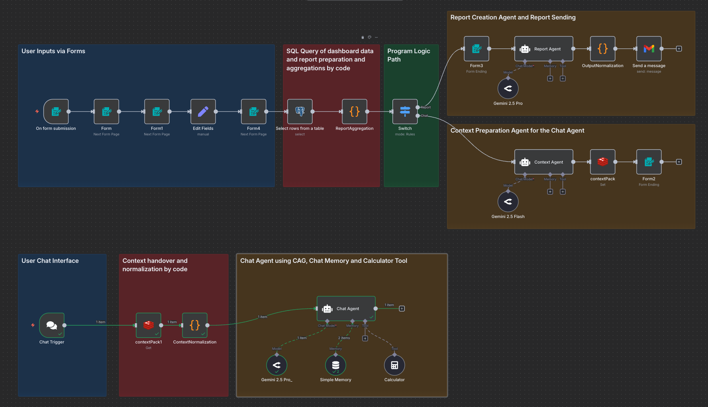

# Marketing Insights Pretotype (Evaluation · Email + Chat) {docker · n8n · postgres · redis · JS}

Automatically turn campaign dashboard data into **actionable insights**—delivered as an email report and available via a **chat assistant** for follow-up Q&A.

**Live entry point:** <https://n8n.rationaleyes.ai/form/pfizer_usecase>  
(enter the same link again if you want to test both evaluation and chat with AI)

**Public repo:** <https://github.com/kaljuste/campaign_evaluation>

---

## What’s inside
- **End-to-end workflow** (n8n), self-hosted with Postgres + Redis + NocoDB; OpenRouter for model access.
- **Two AI paths**  
  - *Report Agent* → email-ready HTML report with standardized sections and “Actionable Insights”.  
  - *Chat Agent* → scoped Q&A grounded in the same prepared context pack.
- **Mock dataset** to simulate monthly performance across markets, channels, specialties, and messages.

**Workflow screenshot**

---

## Quick links
- Start the flow (form): <https://n8n.rationaleyes.ai/form/pfizer_usecase>  
- Mock data browser (NocoDB): <https://nocodb.rationaleyes.ai/dashboard/#/nc/view/fe352a7a-160b-4580-9e24-b555b8a2da40>

**Repo files**
- Workflow: [Campaign_Reporting (n8n_workflow).json](Campaign_Reporting%20(n8n_workflow).json)
- Mock data CSV: [campaign_data.csv](campaign_data.csv)
- Prompts: [report_agent_prompt.md](report_agent_prompt.md) · [context_agent_prompt.md](context_agent_prompt.md) · [chat_agent_prompt.md](chat_agent_prompt.md)
- Code (annotated):  
  [report_aggregation_code (JS).md](report_aggregation_code%20(JS).md) ·
  [context_normalization_code (JS).md](context_normalization_code%20(JS).md) ·
  [output_normalization_code (JS).md](output_normalization_code%20(JS).md)

---

## Business problem & outcome
**Challenge.** Marketers spend time pulling numbers from multiple dashboards (MOP/Adobe/C360) and still lack crisp, actionable recommendations.  
**Pretotype outcome.**
- **Automates** collect → analyze → **deliver** (email).
- Supports **two-way Q&A** with a chat assistant grounded in the same dataset.
- Produces **standardized**, executive-friendly output answering: *What happened? So what? Now what?*

---

## Scope & assumptions (for speed)
- **Brand:** Vydura · **Campaign:** `VYDURA_1`
- **Markets:** Switzerland, Austria · **Periods:** Jun–Aug 2025
- **HCPs:** Cardiologists, Neurologists
- **Channels:** RTE, Newsletter
- **RTE messages:** `M1_Efficacy`, `M2_Safety`, `M3_Access`

Design is **modular and extendable** (add brands/markets/periods/channels/creatives without re-architecting).

---

## How it works
1. **Form intake** → user selects month & country.  
2. **Aggregation code** summarizes volume & rates; best/worst time slots; specialty/channel splits; message performance.  
3. **Prep/Context agent** compacts metrics into a stable **context pack** (JSON).  
4. **Report agent** renders a full **HTML email** (standard sections + Actionable Insights).  
5. **Email** is sent to the marketer.  
6. **Chat agent** answers follow-up questions using the same context.

> **Models:** via OpenRouter. In tests, *Gemini 2.5 Pro* produced strong results; the chat path can use the same or a lighter model when speed is critical.

---

## What the report includes
- **Header** (Marketer, Campaign, Period, Date)  
- **Overview KPIs** (Delivered, Delivery rate, Open rate, Click rate, CTO, Unsub rate, Clicks/1k)  
- **Send Timing — Best & Worst Slots** (ranked by click rate; low-N filtering)  
- **RTE Messages** (performance & winner; Δ click-rate in pp)  
- **Specialty & Channel** comparisons  
- **Mix of sends** (by channel, specialty, message mix)  
- **Weekly trend** (delivered, open %, click %, CTO %, unsub %)

---

## Using the pretotype
**A) Hosted demo**
1. Open the form: <https://n8n.rationaleyes.ai/form/pfizer_usecase>  
2. Select **Period** and **Country**, submit.  
3. Receive the **HTML report** by email.  
4. Use chat for questions like:
   - “Show main KPIs”
   - “Best send times?”
   - “How did *M2_Safety* perform among *neurologists*?”
   - “Compare *RTE vs Newsletter*”

**B) Run locally**
- Import workflow: [Campaign_Reporting (n8n_workflow).json](Campaign_Reporting%20(n8n_workflow).json)  
- Configure connections: Postgres, Redis, NocoDB (optional), OpenRouter API key  
- Choose a model (Gemini 2.5 Pro/Flash, GPT-4.1, etc.)  
- Trigger via n8n UI or the Form node

---

## Design notes & opportunities (Art of the Possible)
- Connectors for MOP/Adobe/C360; multi-brand/region roll-ups  
- A/B testing helper; propose next-month allocations  
- Guardrails when unsub/fatigue flags appear  
- Goal tracking with traffic-light status  
- Comparators vs previous month/market baselines  
- Scheduling: monthly/weekly digests; ad-hoc refresh

---

## Compliance & privacy
- Aggregated, anonymized data only; no HCP-identifiable info  
- Prompts avoid medical advice/off-label content  
- Self-hosted, containerized stack for controlled access

---

## FAQ
**What is RTE?** *Rep-Triggered Email* — emails initiated by field reps with pre-approved content, sent via the CRM/omnichannel stack.  
**Why a “prep/context agent”?** It compacts raw metrics into a stable JSON schema so both report and chat paths are fast and deterministic.  
**Can this scale?** Yes—schema-driven; add dimensions by updating the aggregation step and forms.

*© 2025 — Pretotype for interview demonstration.*
